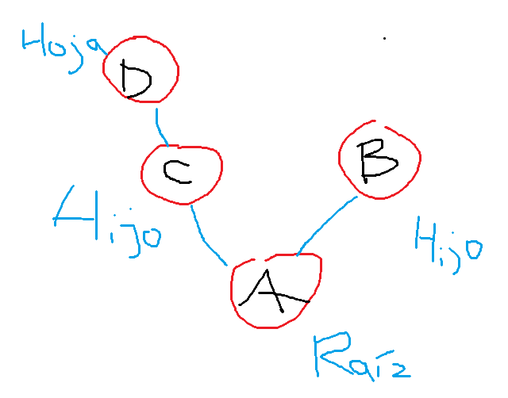
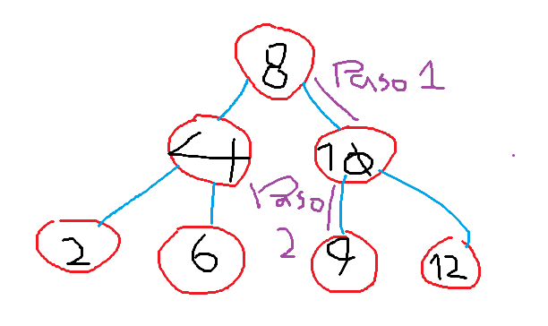
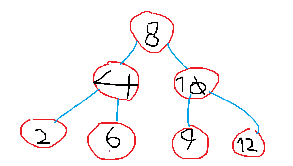

## 1. Motivación

**Pregunta.** ¿Qué problema aparece cuando buscamos muchas veces en una lista?
Que necesitamos revisar cada elemento, y eso toma tiempo y memoria.

## 2. Problemas relacionados
Subordinates: árboles y jerarquías.
El árbol BST, porque trabajamos con una jerarquía.

## 3. Conceptos básicos

Título: Árbol con raíz, dos hijos, al menos una hoja. Técnica: Paint. 

## 4. Árbol binario de búsqueda
**Pregunta.** ¿Por qué el invariante permite descartar una parte del árbol durante la búsqueda?
Porque el valor sólo puede ser o menor o mayor (no admite valores repetidos), así que sólo puede estar o a la izquierda o a la derecha. 

## 5. Búsqueda
**Pregunta.** ¿Qué nodos comparas y qué parte descartas en cada paso?
En el Paso 1, comparamos el 8 y el 9. Como el 9 es mayor, vamos a la derecha, descartamos todo a su izquierda. En el paso 2, comparamos con el 10. Como es menor, vamos a la izquierda, descartamos todo a la derecha. En el paso 3, vemos que 9 = 9. Terminamos.

## 6. Inserción
**Pregunta.** Inserta manualmente los valores del ejemplo y describe dónde queda cada uno.
Iniciamos con el 8. Será la raíz. Luego, el 4 es menor, así que va a la izquierda. El 10 es menor, va a la derecha. Como el árbol es binario, el 8 no tendrá más hijos. El 2 es menor que el 8, vamos a la izquierda. Es menor que el 4, va a si izquierda. Lo mismo pasa con el 6, pero, siendo mayor que el 4, va a su derecha. El 4 no puede tener más hijos. El 9 es mayor que el 8, va hacia el 10. Al ser menor que el 10, va a si izquierda. Lo mismo pasa con el 12, pero queda a la derecha del 10, por ser mayor.

## 7. Altura
**Pregunta.** ¿Qué relación hay entre altura y costo de búsqueda?
La altura es igual al número de comparaciones necesarias en el peor caso.

## 8. Recorridos
**Pregunta.** ¿Por qué inorden produce valores ordenados en un BST?
Porque va de menor a mayor.

## 9. Animaciones
**Pregunta.** ¿Qué te ayuda a ver una animación que no se ve tan claro en una lista de valores?
Ayuda a ver las relaciones entre ellos.

## 10. Implementación
**Pregunta.** ¿Qué métodos parecen depender naturalmente de recursión?
Los de agregar hijos, porque tiene que seguir haciendo comparaciones, y eligiendo entre izquierda y derecha recursivamente, mientras compara con los anteriores.

## 11. Pruebas
**Pregunta.** ¿Qué problema resuelve `evaluar.py`?
El de buscar las pruebas en varias rutas. Ahora es más específico.

## 12. Patrón descubierto
**Pregunta.** Explica con tus palabras el patrón descubierto.
Este patrón consiste en buscar e insterar datos de una forma eficiente. Como los datos se organizan jerárquicamente, podemos ir comparando para filtrar muy rápido. Al buscar, por ejemplo, en vez de comparar con cada valor, decide, entre las dos rutasposibles, cuál tomar al comparar con la raíz del árbol o subárbol, decartando inmediatamente todo lo de la otra.

## 13. Cierre
1. ¿Qué ganamos frente a una lista?

Buscar es mucho más eficiente.

2. ¿Qué propiedad mantiene el BST?

Las relaciones entre los nodos.

3. ¿Qué pasa si insertamos datos ordenados?

Se organizan según la jerarquía del árbol.

4. ¿Cuándo podría degradarse un BST?

Cuando los valores no puedan compararse.

5. ¿Qué problema relacionado puedo practicar?

El de los subordinados: https://cses.fi/problemset/task/1674/